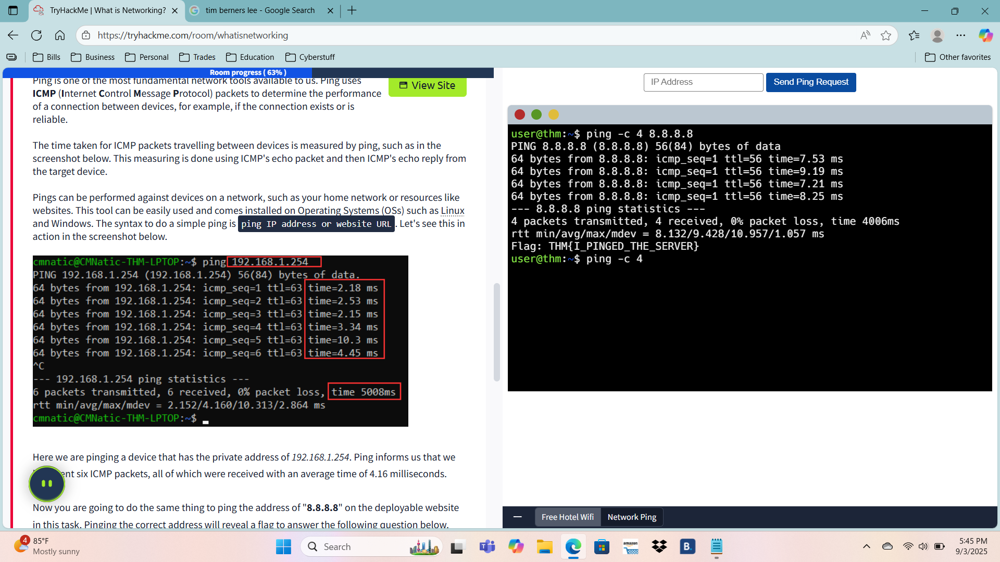

# Networking Intro - TryHackMe

🗓️ Date Completed: Sept 3, 2025

⚙️ Tools Used:  
-'ping'

🧠 Skills Gained:  
-Sending ping requests to IP addresses  
-Understanding packet transmission times  
-Intro to ICMP and basic network troubleshooting

🗒️ Notes:  
-The simulation as hotel WiFI.  
-I used 'ping' to see how fast packets were transmitted to a public IP and learned how ICMP helps diagnose network performance. 

📷Screenshots:  

